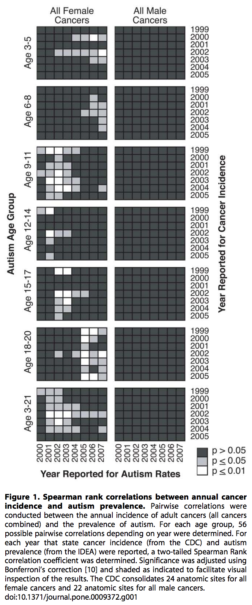
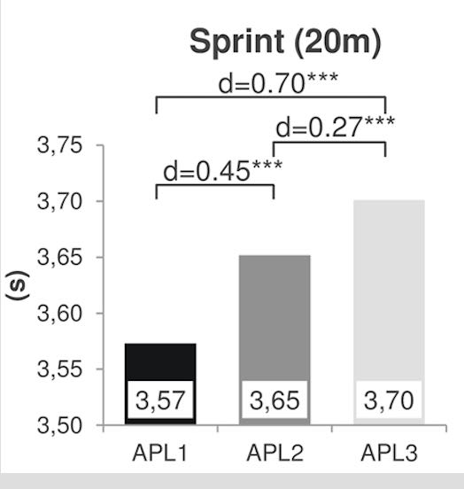

# HW5 - Assignment 2
### Group Members: Tanya Nabila, Rufei Sheng

| **Statistical Analyses**    | **IV(s)**                                                                                                                  | **IV type(s)**                                     | **DV(s)**                                                                | **DV type(s)** | **Control Var** | **Control Var type** | **Question to be answered**                                                                                                      | **_H0_**                                                                                                                                      | **alpha** | **link to paper**                                                                              |
|-----------------------------|----------------------------------------------------------------------------------------------------------------------------|----------------------------------------------------|--------------------------------------------------------------------------|----------------|-----------------|----------------------|----------------------------------------------------------------------------------------------------------------------------------|-----------------------------------------------------------------------------------------------------------------------------------------------|-----------|------------------------------------------------------------------------------------------------|
| Correlation (Spearman Rank) | Children diagnosed with autism from all states and ages between the years 2000-2007                                        | Intervals                                          | Cancer Incidence                                                         | Dichotomous    | None             | None                  | To determine if significant correlations exist between the prevalence of autism and the incidence of cancer.                     | There may be an association between autism and specific forms of cancer.                                                                      | 0.05      | https://journals.plos.org/plosone/article/file?id=10.1371/journal.pone.0009372                 |
| ANOVA                       | 3, players type: professional (adult performance level 1 (APL1), semi-professional (APL2), non-professional players (APL3) | Categorical                                        | 1, the motor "sprint" test (a lower value idicates a better performance) | Continuous     | 0               | None                 | Does motor predictors’ prognostic relevance can provide reliable objective information about future potential of talented player | The motor "sprint" test score of players who reached higher-level APL >= The motor "sprint" test score of players who reached lower-level APL | 0.001     | https://journals.plos.org/plosone/article?id=10.1371/journal.pone.0182211                      |
| Logistic regression         | 1, population size(community size)                                                                                         | discrete(the number of individuals in a community) | 1, experiencing not critical/critical scalar stress                      | dichotomous    | 1, None         | None                 | The relationship between the possibilities of experiencing a critical level of scalar stress and population sizes.               | There is no relationship between 'experiencing critical scalar stress' and 'population size'                                                  | 0.05      | https://journals.plos.org/plosone/article?id=10.1371/journal.pone.0091510#pone-0091510-g005%7C |

*(Tables generated from https://www.tablesgenerator.com/markdown_tables#)*

 
# Major Plots from Correlation article

# Major Plots from ANOVA article

# Major Plots from Correlation article

